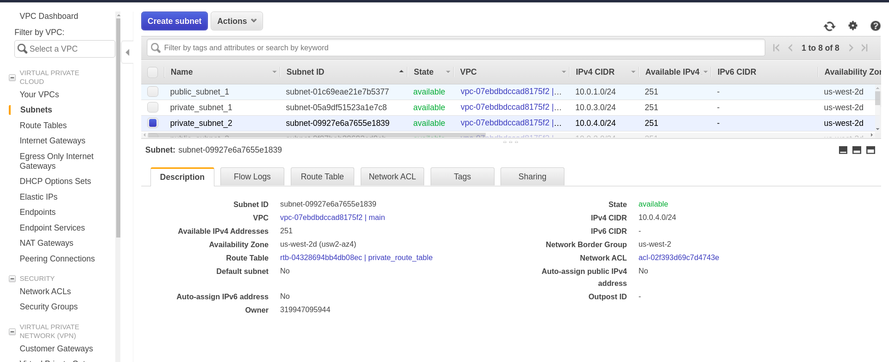

# Infrastructure-As-Code Using Terraform:

The goal of this pipeline is to implement the following infrastructure using terraform:


## Table of Content:
- [AWS Provider](#aws-provider)
- [VPC](#vpc)
- [Internet Gateway](#internet-gateway-on-vpc)
- [Two Private Subnets](#two-private-subnets)
- [Private Route Table](#private-route-table)
- [Private Route Table Assiociations](#private-route-table-assiociations)
- [Two Public Subnets](#two-public-subnets)
- [Public Route Table](#public-route-table)
- [Public Route Table Assiociations](#public-route-table-assiociations)
<hr>

### AWS Provider:
```
export AWS_ACCESS_KEY_ID="anaccesskey"
```
```
export AWS_SECRET_ACCESS_KEY="asecretkey"
```
```
export AWS_DEFAULT_REGION="us-west-2"
```

```
provider "aws" {}
```

<hr>

### VPC:

```
# Create Main VPC
resource "aws_vpc" "main" {
  cidr_block       = "10.0.0.0/16"

  tags = {
    Name = "main"
  }
}
```


<hr>

### Internet Gateway on VPC:

```
# Main Internet Gateway
resource "aws_internet_gateway" "gw" {
  vpc_id = aws_vpc.main.id

  tags = {
    Name = "main_internet_gateway"
  }
}
```


<hr>

### Two Private Subnets:

```
# Private Subnets
resource "aws_subnet" "private_subnet_1" {
  vpc_id     = aws_vpc.main.id
  cidr_block = "10.0.3.0/24"

  tags = {
    Name = "private_subnet_1"
  }
}


resource "aws_subnet" "private_subnet_2" {
  vpc_id     = aws_vpc.main.id
  cidr_block = "10.0.4.0/24"
  
  tags = {
    Name = "private_subnet_2"
  }
}
```




<hr>

### Private Route Table:

```
# Private Route Table
resource "aws_route_table" "private_route_table" {
  vpc_id = aws_vpc.main.id

  tags = {
    Name = "private_route_table"
  }
}
```


<hr>

### Private Route Table Assiociations:

```
# Route-Table Associations
resource "aws_route_table_association" "rt_private_subnet_1" {
  subnet_id      = aws_subnet.private_subnet_1.id
  route_table_id = aws_route_table.private_route_table.id
}


resource "aws_route_table_association" "rt_private_subnet_2" {
  subnet_id      = aws_subnet.private_subnet_2.id
  route_table_id = aws_route_table.private_route_table.id
}
```


<hr>


### Two Public Subnets:

```
# Public Subnets
resource "aws_subnet" "public_subnet_1" {
  vpc_id     = aws_vpc.main.id
  cidr_block = "10.0.1.0/24"
  map_public_ip_on_launch = true

  tags = {
    Name = "public_subnet_1"
  }
}


resource "aws_subnet" "public_subnet_2" {
  vpc_id     = aws_vpc.main.id
  cidr_block = "10.0.2.0/24"
  map_public_ip_on_launch = true

  tags = {
    Name = "public_subnet_2"
  }
}
```


<hr>

### Public Route Table:

```
# Public Route Table
resource "aws_route_table" "public_route_table" {
  vpc_id = aws_vpc.main.id

  route {
    cidr_block = "0.0.0.0/0"
    gateway_id = aws_internet_gateway.gw.id
  }


  tags = {
    Name = "public_route_table"
  }
}
```


<hr>

### Public Route Table Assiociations:

```
# Route-Table Associations
resource "aws_route_table_association" "rt_pub_subnet_1" {
  subnet_id      = aws_subnet.public_subnet_1.id
  route_table_id = aws_route_table.public_route_table.id
}


resource "aws_route_table_association" "rt_pub_subnet_2" {
  subnet_id      = aws_subnet.public_subnet_2.id
  route_table_id = aws_route_table.public_route_table.id
}
```

